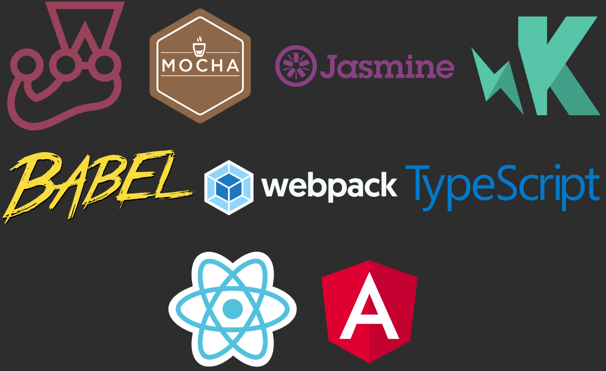

### Timeline

 

  

    

      <h3>Sep-2015</h3>
      
Internship JS Mutation testing

    

  

  

    

      <h3>Apr-2016</h3>
      
Release 0.1

    

  
  
  

    

      <h3>Feb-2017</h3>
      
Info Support sponsorship

      
    

  

 

---

 

  

    

      <h3>2017~2018</h3>
      
    

  

  

    

      <h3>Oct-2018</h3>
      
.NET and Scala support

    

  
  
  

    

      <h3>Feb-2019</h3>
      
Stryker v1

    

  
 
  

    

      <h3>Mar-2019</h3>
      
Stryker.NET Full Framework support

    

  
 

  